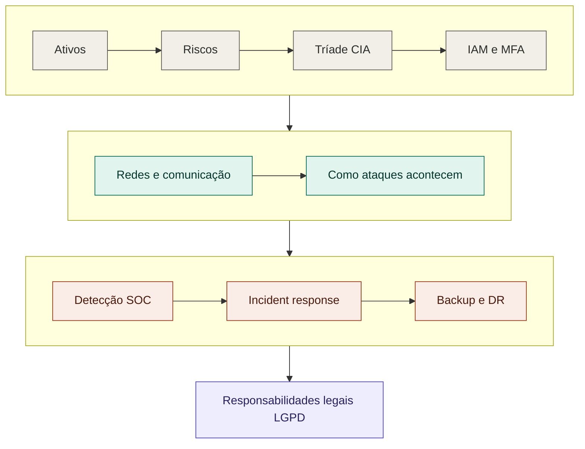

# 🧭 Fundamentos de Segurança da Informação

Documento de referência teórica — a base conceitual que sustenta toda a minha jornada em Cibersegurança. Organizado em torno de 10 perguntas-chave que formam um mapa mental da área, do "o que proteger" até "quais são nossas responsabilidades legais".

---

## 🔐 1. O que estamos protegendo?

Antes de qualquer ferramenta ou ataque, segurança começa por entender **o que tem valor**.

- **Ativo (Asset):** qualquer coisa de valor para uma organização — dados, sistemas, hardware, reputação, pessoas.
- **Dado vs. Informação:** dado é bruto (ex: uma sequência de números); informação é o dado com contexto e significado (ex: "este número é o CPF do cliente X").
- **Sistema:** conjunto de componentes (hardware + software) que processam informação.
- **Serviço:** funcionalidade oferecida por um sistema (ex: e-mail, login, banco de dados).

**Pergunta central:** o que aconteceria se esse ativo fosse exposto, alterado ou destruído? Essa pergunta guia toda análise de risco.

---

## 🎯 2. O que pode dar errado?

- **Ameaça (Threat):** qualquer coisa com potencial de causar dano (um atacante, um erro humano, um desastre natural).
- **Vulnerabilidade (Vulnerability):** uma fraqueza que pode ser explorada (ex: sistema desatualizado, senha fraca).
- **Risco (Risk):** a probabilidade de uma ameaça explorar uma vulnerabilidade, multiplicada pelo impacto.
- **Incidente (Incident):** quando o risco se concretiza — um evento de segurança confirmado que causou (ou tentou causar) dano.

**Fórmula mental:** Ameaça + Vulnerabilidade = Risco. Risco realizado = Incidente.

---

## 🛡️ 3. Como protegemos? — A Tríade CIA

O núcleo da Segurança da Informação:

| Princípio | Pergunta que responde | Exemplo de controle |
|-----------|------------------------|----------------------|
| **Confidentiality** (Confidencialidade) | Quem pode acessar essa informação? | Criptografia, controle de acesso |
| **Integrity** (Integridade) | Como sei que não foi alterada indevidamente? | Hashes, assinaturas digitais, logs de auditoria |
| **Availability** (Disponibilidade) | O sistema estará disponível quando necessário? | Backups, redundância, proteção contra DDoS |

Todo controle de segurança existe para proteger um (ou mais) desses três pilares.

---

## 👤 4. Quem deveria ter acesso?

Conceitos de **Gestão de Identidade e Acesso (IAM — Identity and Access Management)**:

- **Autenticação (Authentication):** provar que você é quem diz ser (senha, biometria, token)
- **Autorização (Authorization):** definir o que essa identidade autenticada pode fazer
- **MFA (Multi-Factor Authentication):** exigir mais de um fator de prova (ex: senha + código no celular)
- **Privilégio mínimo (Principle of Least Privilege):** dar a cada usuário/sistema apenas o acesso estritamente necessário para sua função
- **Controle de acesso (Access Control):** mecanismos que aplicam as regras de quem acessa o quê

**Pergunta prática:** o que acontece com os acessos de um funcionário quando ele sai da empresa? (offboarding é uma falha de segurança comum quando mal feito)

---

## 🌐 5. Como os sistemas se comunicam?

Base de **Networking aplicado à segurança** (conecta com o que já documentamos na Semana 01):

- **IP:** endereço que identifica um dispositivo na rede
- **DNS (Domain Name System):** "tradutor" que converte nomes (ex: google.com) em endereços IP
- **DHCP (Dynamic Host Configuration Protocol):** atribui endereços IP automaticamente aos dispositivos numa rede
- **Portas:** identificam o serviço específico dentro de um dispositivo
- **TCP vs UDP:** protocolos de transmissão (confiável vs rápido — já documentado no glossário)

**Pergunta de segurança:** onde, dentro dessa comunicação, poderíamos detectar um comportamento malicioso? (essa é a base do monitoramento de rede em um SOC)

---

## 🦠 6. Como um ataque acontece?

Pensar como um atacante (mentalidade ofensiva) para se defender melhor:

- **Phishing:** engano via mensagem (e-mail, SMS) para roubar credenciais ou instalar malware
- **Malware:** software malicioso (vírus, ransomware, spyware, trojans)
- **Engenharia social (Social Engineering):** manipulação psicológica para obter acesso ou informação
- **Exploração de vulnerabilidades:** uso técnico de uma falha para obter acesso não autorizado
- **Escalonamento de privilégios (Privilege Escalation):** transformar um acesso limitado em um acesso maior
- **Movimentação lateral (Lateral Movement):** avançar de um sistema comprometido para outros dentro da mesma rede
- **Exfiltração de dados (Data Exfiltration):** retirar dados roubados do ambiente da vítima

**Frameworks de referência:**
- **Cyber Kill Chain:** modelo que descreve as etapas de um ataque, do reconhecimento até o objetivo final
- **MITRE ATT&CK:** base de conhecimento cataloga táticas e técnicas reais usadas por atacantes — referência padrão da indústria

---

## 🔎 7. Como saberemos que fomos atacados?

Base do trabalho de **SOC / Blue Team** (conecta com a sala "Introduction to Defensive Security" já documentada):

- **Evento (Event):** qualquer ocorrência registrável em um sistema (ex: um login)
- **Alerta (Alert):** um evento que atende a uma regra suspeita e merece atenção
- **Incidente (Incident):** um alerta confirmado como uma ameaça real
- **Log:** registro histórico de eventos em um sistema
- **SIEM (Security Information and Event Management):** ferramenta que coleta e correlaciona logs de várias fontes para gerar alertas
- **Falso positivo:** um alerta que parecia malicioso, mas não era

**Fluxo típico:** Logs → SIEM → Alertas → Investigação → Incidente confirmado (ou descartado como falso positivo)

---

## 🚨 8. O que fazemos quando descobrimos um ataque?

**Resposta a Incidentes (Incident Response)** — ciclo que já vivenciei na prática na sala de Segurança Defensiva:

1. **Identificar** — confirmar que é um incidente real
2. **Conter** — impedir que o dano se espalhe (ex: bloquear uma conta comprometida)
3. **Erradicar** — eliminar a causa raiz (remover malware, corrigir vulnerabilidade)
4. **Recuperar** — restaurar sistemas e serviços ao normal
5. **Documentar/Aprender** — registrar o ocorrido para melhorar defesas futuras (Threat Intelligence)

---

## 💾 9. E se tudo der errado?

**Continuidade de Negócios e Recuperação de Desastres:**

- **Backup:** cópia de segurança dos dados — só tem valor se **funcionar** quando restaurado (testar backups é essencial)
- **Disaster Recovery (DR):** plano para restaurar sistemas após um desastre
- **Business Continuity (BC):** plano mais amplo para manter a organização funcionando durante uma crise
- **RTO (Recovery Time Objective):** por quanto tempo a organização pode ficar sem o sistema
- **RPO (Recovery Point Objective):** quanto de dado (em tempo) a organização pode se dar ao luxo de perder

---

## ⚖️ 10. Quais são nossas responsabilidades?

Segurança não é só técnica — envolve **governança, risco e conformidade (GRC)**:

- Quais leis se aplicam à organização e aos dados que ela trata?
- Como os dados pessoais devem ser tratados?
- Quem é o responsável (accountable) por cada tipo de informação?
- Quais políticas e procedimentos formais precisam existir?

**No Brasil:** a **LGPD (Lei Geral de Proteção de Dados)** é a legislação central — define regras para coleta, uso, armazenamento e compartilhamento de dados pessoais, com direitos para os titulares dos dados e obrigações para as organizações.

---

## 🗺️ Visão geral — como as perguntas se conectam

