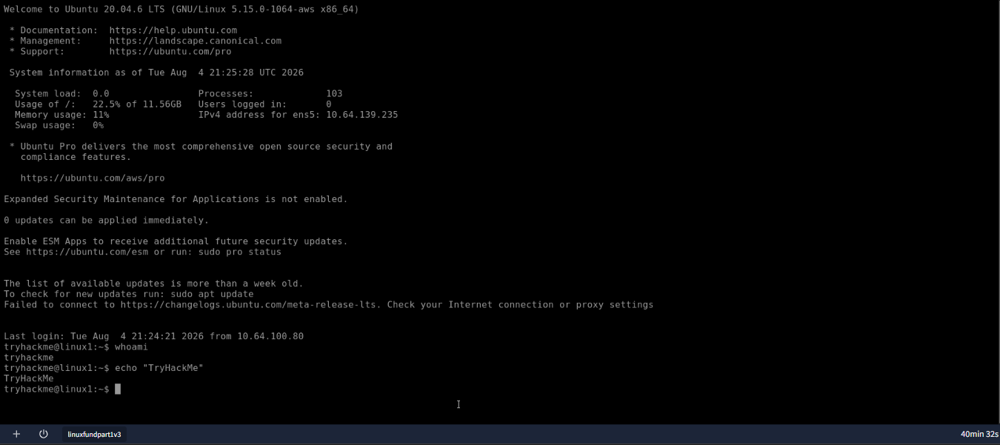
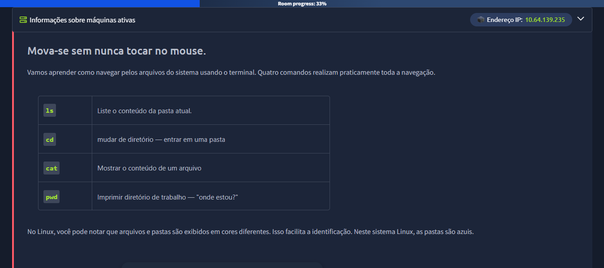
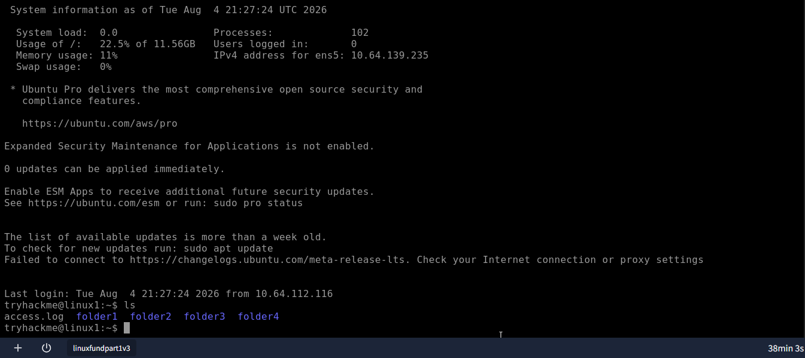
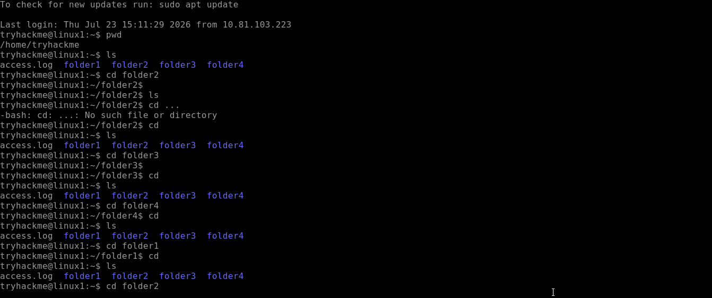
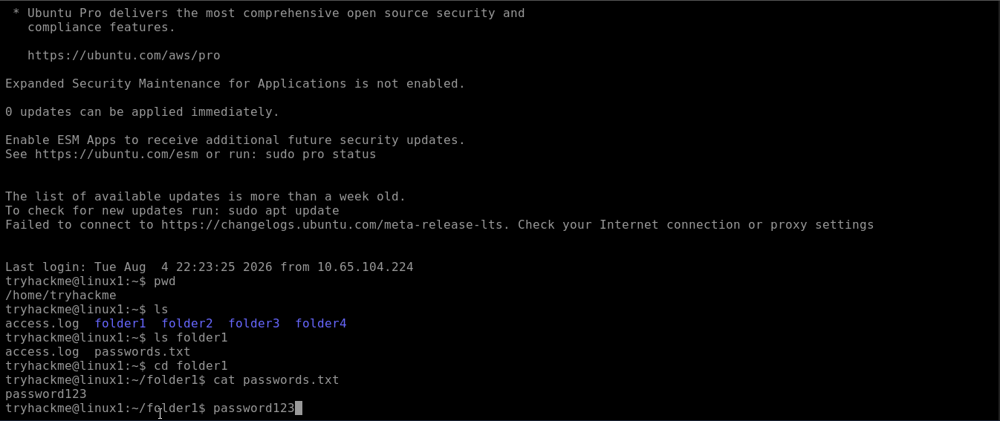
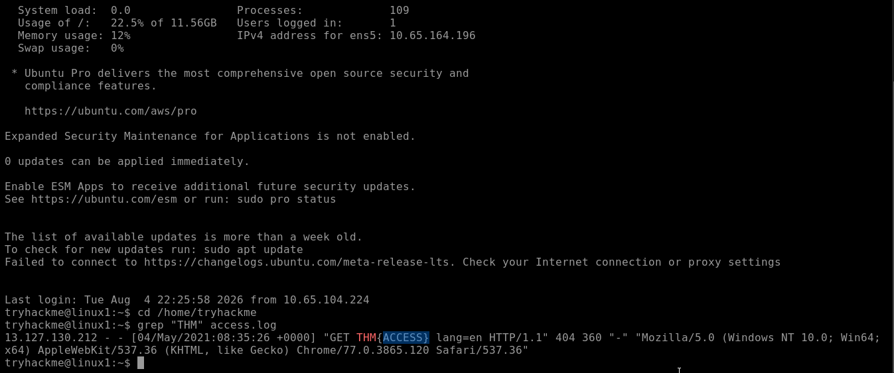
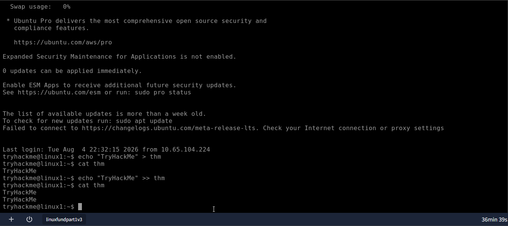
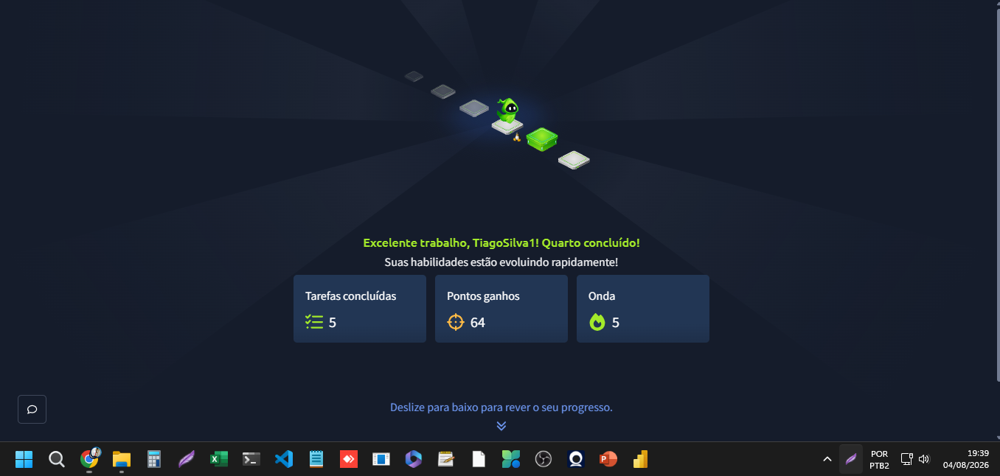

# Semana 01 — Networking Fundamentals & Linux Commands

## Objetivo
Entender os conceitos básicos de redes de computadores e praticar comandos essenciais do Linux, usando o TryHackMe como ambiente prático.

## Tarefas

- [x] Completar sala "Intro to Networking" (ou similar) no TryHackMe
- [x] Completar sala "Linux Fundamentals" no TryHackMe
- [x] Anotar conceitos-chave (IP, portas, protocolos)
- [x] Praticar comandos Linux no terminal

## Conceitos aprendidos

### Endereço IP
Um endereço IP é o identificador único de um dispositivo dentro de uma rede — funciona como um "endereço postal" digital, permitindo que os dados saibam para onde devem ser enviados.

**Exemplo:** 192.168.1.10
Esse endereço identifica um dispositivo específico dentro de uma rede local.

---

### Portas
Enquanto o IP identifica o dispositivo, a **porta** identifica qual serviço/programa específico deve receber os dados dentro daquele dispositivo. Funciona como o "número do apartamento" dentro de um "prédio" (o IP).

**Formato:** `IP:PORTA`

**Exemplo:** 192.168.1.10:443

**Portas mais comuns:**

| Porta | Serviço | Função |
|-------|---------|--------|
| 80    | HTTP    | Navegação web (sem criptografia) |
| 443   | HTTPS   | Navegação web (com criptografia) |
| 22    | SSH     | Acesso remoto seguro a servidores |
| 21    | FTP     | Transferência de arquivos |

**Relevância para segurança:** boa parte do reconhecimento de rede (*network enumeration*) em pentest consiste em identificar quais portas estão abertas em um alvo e quais serviços rodam nelas — isso revela pontos de entrada possíveis.

---

### Protocolos: TCP vs UDP

Protocolos são as "regras" que definem como os dados trafegam pela rede.

**TCP (Transmission Control Protocol)**
- Orientado à conexão: faz um "aperto de mão" (*three-way handshake*) antes de transmitir
- Garante entrega e ordem correta dos dados
- Mais lento, porém confiável
- Usado em: navegação web (HTTP/HTTPS), e-mail, transferência de arquivos

**UDP (User Datagram Protocol)**
- Não orientado à conexão: envia os dados sem confirmação de entrega
- Mais rápido, porém sem garantias
- Usado em: streaming de vídeo, jogos online, chamadas de voz (VoIP)

**Analogia:** TCP é como enviar uma carta registrada, com confirmação de recebimento. UDP é como jogar um bilhete pela janela — mais rápido, mas sem garantia de que chegou ao destino.

---

### Resumo comparativo

| Característica | TCP | UDP |
|-----------------|-----|-----|
| Confiabilidade | Alta | Baixa |
| Velocidade | Mais lenta | Mais rápida |
| Conexão | Orientado à conexão | Sem conexão |
| Exemplo de uso | HTTP, HTTPS, FTP | Streaming, jogos online |

## 🖥️ Comandos praticados (Linux Fundamentals Part 1 — TryHackMe)

### Comandos básicos: whoami e echo
- `whoami` — identifica o usuário logado no sistema
- `echo "texto"` — exibe texto na tela, base para scripts e automações


*Prática dos comandos `whoami` (identificação do usuário logado) e `echo` (exibição de texto), fundamentos usados constantemente em scripts e automações de segurança.*

### Navegação de diretórios: pwd, ls, cd, cat
- `pwd` — mostra o diretório atual
- `ls` — lista o conteúdo do diretório
- `cd` — muda de diretório (`cd ..` sobe um nível; `cd` sozinho volta para home)
- `cat` — exibe o conteúdo de um arquivo


*Tabela introdutória dos 4 comandos essenciais de navegação no terminal Linux.*


*Primeira execução do comando `ls`, revelando a estrutura de pastas do ambiente de laboratório.*


*Navegação até a pasta `folder1` e leitura do arquivo `passwords.txt` com o comando `cat`, revelando o conteúdo `password123`.*


*Exploração das pastas folder1 a folder4, incluindo o aprendizado prático da sintaxe correta do comando `cd ..` (dois pontos) para retornar ao diretório pai, e do uso de `cd` sem argumentos para retornar diretamente ao diretório pessoal (home).*

### Busca de conteúdo com grep
- `grep "padrão" arquivo` — busca um padrão de texto dentro de um arquivo


*Uso do comando `grep` para buscar o padrão de texto "THM" dentro do arquivo de log `access.log`, revelando a flag `THM{ACCESS}` — prática direta de análise de logs, técnica central em investigações de segurança.*

### Redirecionadores de saída: > e >>
- `>` — sobrescreve o conteúdo de um arquivo
- `>>` — adiciona conteúdo ao final do arquivo, preservando o que já existia


*Demonstração prática da diferença entre os operadores de redirecionamento `>` (sobrescreve o arquivo) e `>>` (adiciona ao final, preservando conteúdo existente) — confirmado pela duplicação do texto "TryHackMe" no arquivo `thm` após o uso do `>>`.*

### Operadores de controle: & e &&
- `&` — executa um comando em segundo plano (background)
- `&&` — executa o segundo comando somente após o sucesso do primeiro

---

## ✅ Room concluída

Room **"Linux Fundamentals Part 1"** finalizada com sucesso — 5 tarefas completadas, 64 pontos, streak de 5 dias.


*Confirmação oficial de conclusão da room "Linux Fundamentals Part 1" no TryHackMe: 5 tarefas completadas, 64 pontos conquistados e streak de 5 dias consecutivos de estudo.*

### Rede e diagnóstico

| Comando | Função |
|---------|--------|
| `ifconfig` ou `ip a` | Mostra as interfaces de rede e endereços IP da máquina |
| `ping IP_ou_dominio` | Testa se um host está acessível na rede |
| `whoami` | Mostra o usuário atual logado |
| `hostname` | Mostra o nome da máquina na rede |
| `netstat -tuln` | Lista portas abertas e conexões ativas na máquina |

---

### Permissões

| Comando | Função |
|---------|--------|
| `chmod +x arquivo` | Torna um arquivo executável |
| `sudo comando` | Executa um comando com privilégios de administrador |

---

### Exemplo prático

```bash
# Verificar meu IP na rede
ip a

# Testar se consigo alcançar outro dispositivo
ping 192.168.1.1

# Ver o que está rodando/aberto na minha máquina
netstat -tuln
```

**Observação:** esses comandos foram praticados no ambiente do TryHackMe / Kali Linux, seguindo os exercícios da sala de Linux Fundamentals.

## Prática — TryHackMe

### 🏆 Sala concluída: Offensive Security Intro
**Trilha:** Cyber Security 101 → Start Your Cyber Security Journey

**Progresso:** 4/4 tarefas concluídas | 40 pontos ganhos

**O que foi praticado:**
- Diferença entre segurança **ofensiva** (pensar como atacante) e **defensiva** (proteger sistemas)
- Uso da ferramenta `dirb` para descobrir páginas ocultas em um site (enumeração de diretórios)
- Exploração de uma vulnerabilidade real: acesso não autenticado a um painel administrativo (`/bank-transfer`) que permitia manipular saldos bancários
- Conceito de **"security through obscurity"** — esconder uma URL não é o mesmo que protegê-la; a correção correta é exigir autenticação (login)

**Flag conquistada:** `BANK-HACKED`


**Reflexão:** essa foi minha primeira experiência prática de identificar e explorar uma vulnerabilidade real (mesmo que em ambiente simulado). Ficou claro como falhas simples de autenticação podem expor funcionalidades críticas de um sistema.

---
### 🛡️ Sala concluída: Introduction to Defensive Security
**Trilha:** Cyber Security 101 → Start Your Cyber Security Journey

**Progresso:** 5/5 tarefas concluídas | 40 pontos ganhos

**O que foi praticado:**
- Papel de um analista de **SOC (Security Operations Center)** — atuando na defesa de uma organização
- Identificação de um alerta de segurança: tentativas suspeitas de login (ataque de **brute-force**)
- **Contenção** do incidente: bloqueio da conta comprometida (`dave.saunders`) antes que o ataque fosse bem-sucedido
- Registro de **Threat Intelligence** (inteligência de ameaças) sobre o grupo atacante identificado (`ShadowFigures`)
- Elaboração de um **relatório de incidente** completo, formalizando o ocorrido

**Flag conquistada:** `THM{ACCOUNT-LOCKED}`


**Reflexão:** essa sala me mostrou a outra face da segurança — em vez de atacar/explorar, o foco foi identificar, conter e documentar um ataque em andamento. Entendi na prática o ciclo de resposta a incidentes (identificar → conter → investigar → documentar), que é a base do trabalho de um analista SOC/Blue Team.

---

## Dificuldades encontradas
