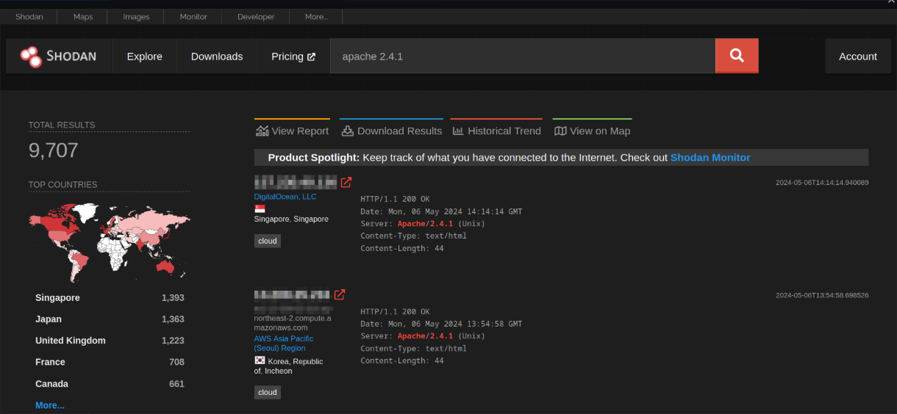
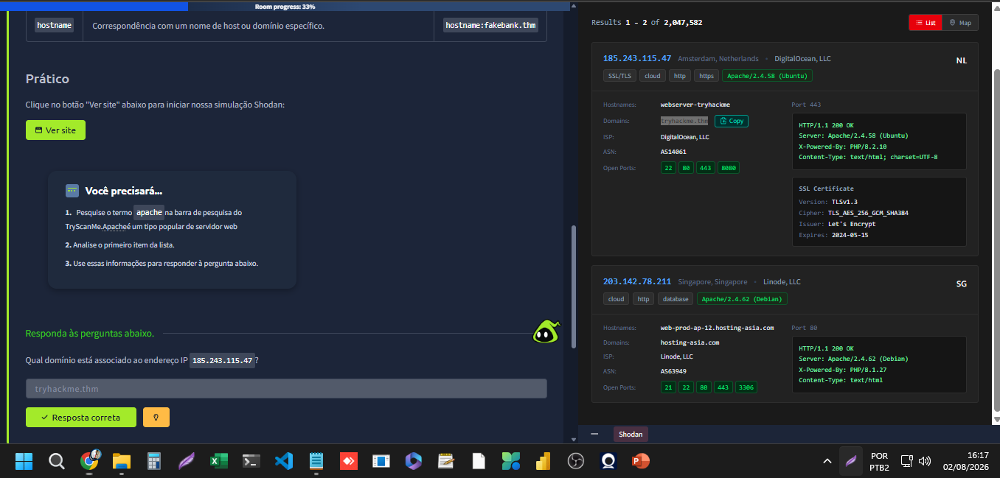
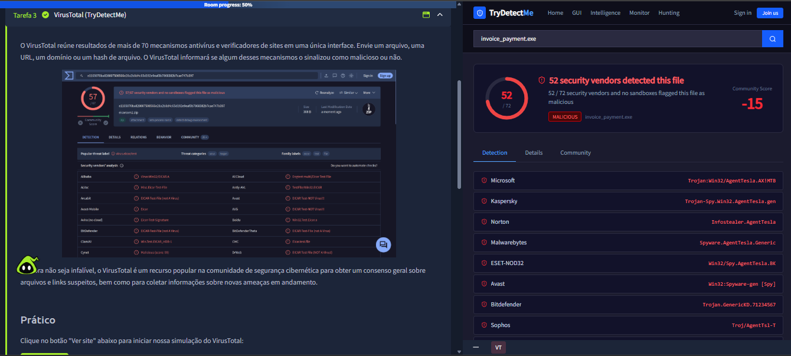
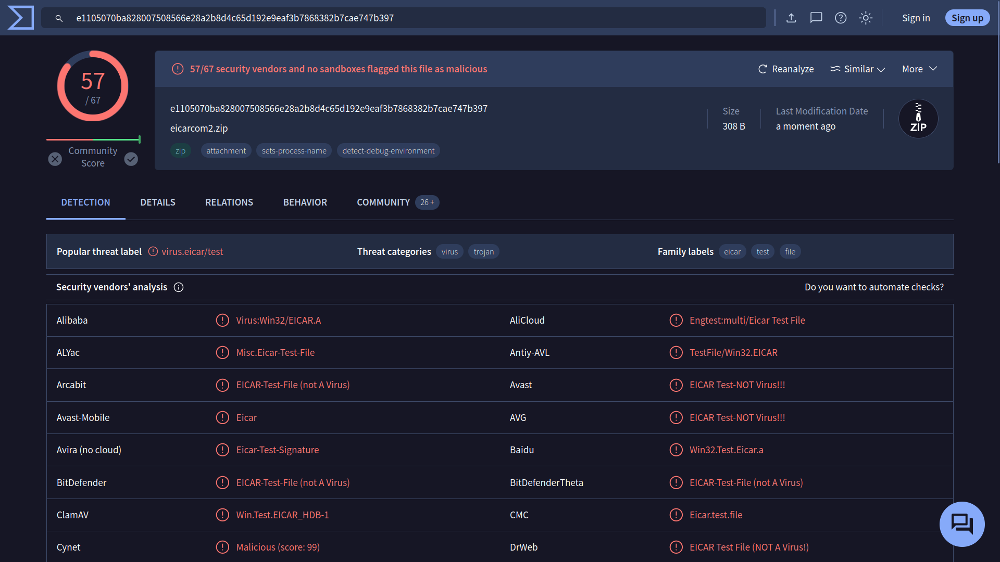
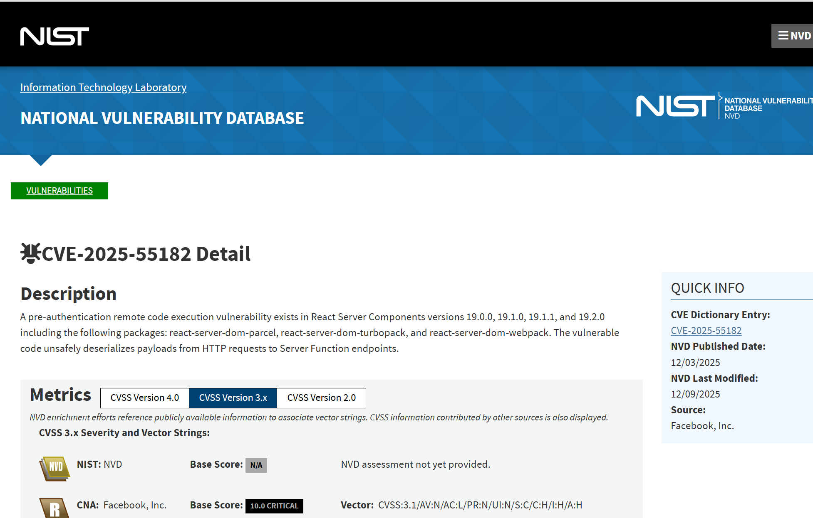
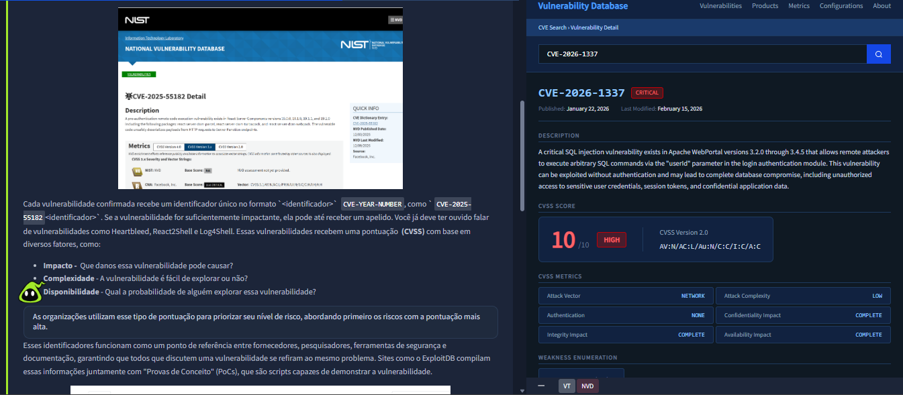
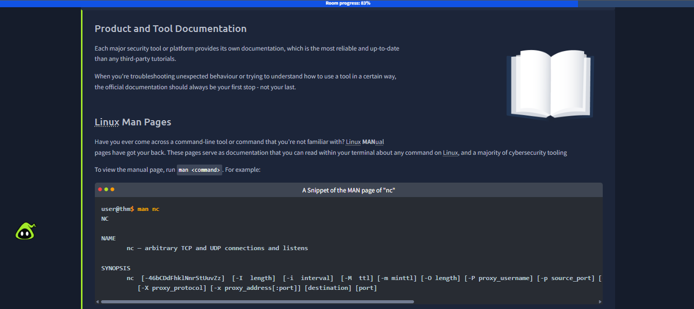
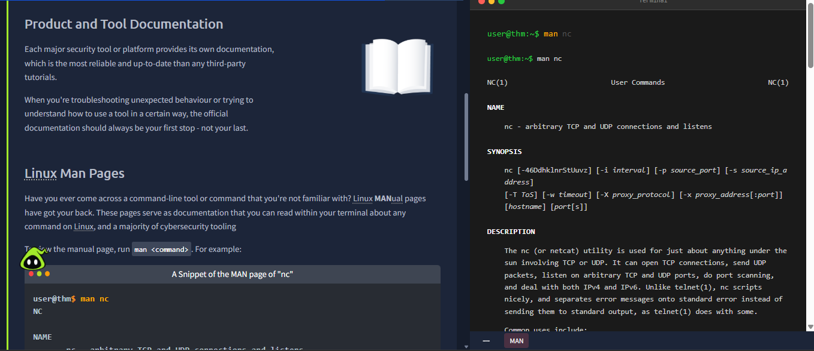
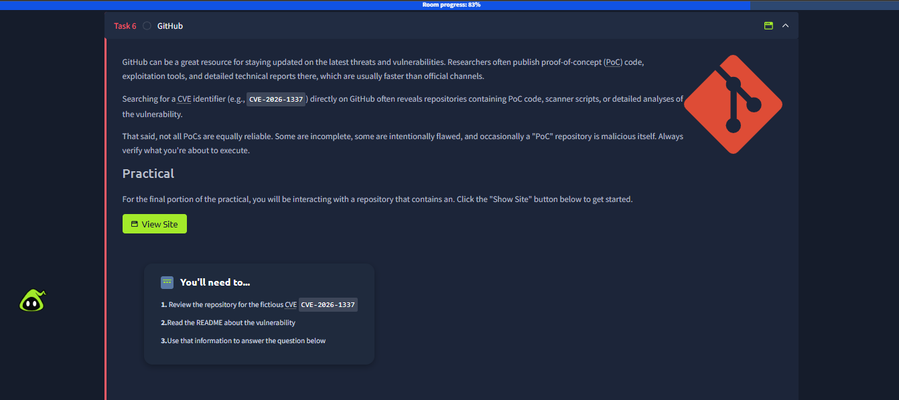
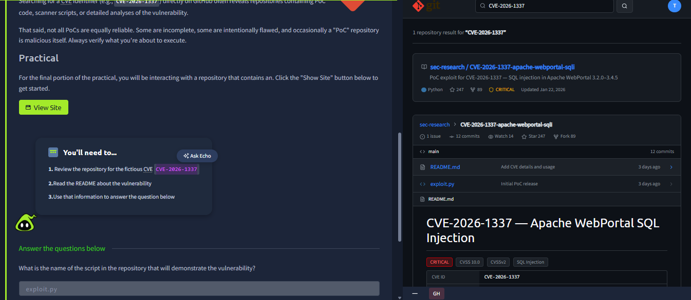

# Semana 02 — Search Skills & OSINT

## 🎯 Objetivo da semana
Desenvolver habilidades de busca e reconhecimento (OSINT) essenciais em cibersegurança, através do room "Habilidades de Busca" (Search Skills) do TryHackMe, trilha Cyber Security 101.

## 🔗 Room
[Search Skills — TryHackMe](https://tryhackme.com/room/searchskills)

---

## Tarefa 2 — Reconhecimento com Shodan (via TryScanMe)

**O que foi praticado:**
- Uso de um motor de busca especializado em dispositivos conectados à internet (Shodan), simulado via ambiente TryScanMe
- Pesquisa por banner de serviço (`apache`) para identificar servidores expostos publicamente
- Análise de metadados retornados por um scan de reconhecimento: IP, geolocalização, ISP, portas abertas, versão de software, certificado SSL/TLS
- Correlação entre endereço IP e domínio associado, como parte de um processo de OSINT (Open Source Intelligence)

**Conceito-chave:** Ferramentas como o Shodan permitem mapear ativos expostos na internet (servidores, IoT, sistemas industriais) antes mesmo de qualquer interação direta — uma etapa fundamental da fase de reconhecimento em testes de segurança, também usada por defensores para identificar exposição não intencional da própria infraestrutura.

**Evidência:**

*Tela inicial da Tarefa 2 do room, introduzindo o uso do Shodan como ferramenta de reconhecimento.*

*Reconhecimento de infraestrutura via motor de busca especializado (TryScanMe/Shodan): identificação de servidor Apache 2.4.58 exposto publicamente, incluindo portas abertas, certificado SSL e domínio associado ao IP consultado.*

---

## Tarefa 3 — VirusTotal (TryDetectMe)

**O que foi praticado:**
- Uso do VirusTotal, plataforma que agrega mais de 70 mecanismos de antivírus e verificadores de reputação em uma única interface, para análise de arquivos, URLs, domínios e hashes suspeitos
- Envio e análise de um arquivo malicioso simulado (`invoice_payment.exe`) — nome típico de engenharia social usado em campanhas de phishing (fatura/pagamento como isca)
- Interpretação do Community Score e da taxa de detecção entre motores de segurança (52 de 72 fornecedores sinalizaram o arquivo como malicioso)
- Leitura de rótulos de ameaça atribuídos por diferentes vendors, reconhecendo a família de malware AgentTesla (infostealer/RAT usado para roubo de credenciais)
- Compreensão da limitação da ferramenta: o VirusTotal não é infalível, mas serve como recurso de consenso da comunidade para triagem rápida de arquivos e links suspeitos

**Conceito-chave:** O VirusTotal é uma ferramenta essencial na fase de análise/triagem de um SOC — permite verificar rapidamente se um arquivo, hash ou URL é conhecido como malicioso, sem necessidade de executá-lo em ambiente isolado. A convergência de múltiplos vendors com rótulos similares reforça a confiabilidade da identificação da ameaça.

**Evidência:**

*Análise de um arquivo suspeito (arquivo de teste EICAR) no VirusTotal, evidenciando o uso da plataforma para consolidar resultados de múltiplos mecanismos de antivírus em uma única interface, permitindo triagem rápida de arquivos potencialmente maliciosos através do consenso entre diferentes fornecedores de segurança.*

*Resultado da análise do arquivo `invoice_payment.exe` — um nome característico de técnica de engenharia social (isca de fatura/pagamento) — mostrando detecção por 52 de 72 fornecedores de segurança (Community Score -15) e identificação convergente da ameaça como pertencente à família de malware AgentTesla (infostealer/trojan usado para roubo de credenciais), reforçando a confiabilidade da classificação através do consenso entre múltiplos vendors (Microsoft, Kaspersky, Norton, Malwarebytes, ESET-NOD32, entre outros).*

---

## Tarefa 4 — Bancos de Dados de Vulnerabilidades (CVE)

**O que foi praticado:**
- Exploração do NVD (National Vulnerability Database), mantido pelo NIST, como fonte oficial de consulta de vulnerabilidades catalogadas
- Leitura e interpretação de uma entrada CVE real (`CVE-2025-55182`), incluindo descrição técnica, datas de publicação/atualização, e organização responsável pela divulgação (CNA)
- Compreensão do padrão de nomenclatura `CVE-<ANO>-<NÚMERO>`, identificador único usado entre fornecedores, pesquisadores e ferramentas de segurança
- Interpretação do sistema de pontuação CVSS (Common Vulnerability Scoring System), com os fatores: Impacto, Complexidade e Disponibilidade
- Leitura do Vector String CVSS, que decompõe a pontuação em métricas técnicas específicas
- Análise de uma vulnerabilidade crítica real (score 10.0 CRITICAL) em React Server Components — RCE pré-autenticação por desserialização insegura
- Exploração da seção de Referências de uma CVE (advisories, patches, Exploit-DB, Snyk) e da tabela de produtos afetados
- Introdução ao conceito de CPE (Common Platform Enumeration)

**Conceito-chave:** O CVE funciona como uma "linguagem comum" entre toda a comunidade de segurança, permitindo que fornecedores, pesquisadores e times de resposta a incidentes se refiram exatamente à mesma vulnerabilidade. O CVSS complementa isso fornecendo critério objetivo de priorização, essencial para times de SOC decidirem o que corrigir primeiro.

**Evidência:**

*Consulta à entrada CVE-2025-55182 no National Vulnerability Database (NIST), evidenciando uma vulnerabilidade crítica (CVSS 10.0) de execução remota de código pré-autenticação em React Server Components, causada por desserialização insegura de payloads HTTP em endpoints de Server Functions.*

*Estudo dos componentes de uma entrada CVE — formato de identificador, fatores de pontuação CVSS (impacto, complexidade, disponibilidade) e exemplo prático de vulnerabilidade em Apache WebPortal, incluindo produtos afetados, referências oficiais (advisory, patch) e identificadores CPE das versões vulneráveis.*

## Tarefa 5 — Documentação Técnica (MAN)

**O que foi praticado até aqui:**
- Introdução ao conceito de documentação oficial de produtos e ferramentas como fonte mais confiável de informação técnica, superior a tutoriais de terceiros
- Exploração das Linux Man Pages, sistema de documentação nativo do Linux acessível via `man <comando>`
- Execução prática do comando `man nc` em ambiente simulado de terminal, navegando pela estrutura padrão de uma man page:
  - **NAME** — identificação e propósito da ferramenta
  - **SYNOPSIS** — sintaxe completa de uso, incluindo todas as flags/opções disponíveis (`-i interval`, `-p source_port`, `-w timeout`, `-X proxy_protocol`, entre outras)
  - **DESCRIPTION** — explicação detalhada da ferramenta `nc` (netcat), incluindo seus casos de uso: conexões TCP/UDP, port scanning, suporte a IPv4/IPv6

**Conceito-chave:** Documentação oficial (como as man pages) é a fonte primária e mais confiável para entender o funcionamento real de uma ferramenta, especialmente durante troubleshooting — deve ser sempre a primeira consulta, não a última, antes de recorrer a tutoriais externos que podem estar desatualizados.

**Evidência:**

*Introdução ao conceito de documentação técnica oficial (Man Pages do Linux), destacando sua confiabilidade como fonte primária de consulta para troubleshooting e uso correto de ferramentas de linha de comando.*

*Execução do comando `man nc` em ambiente prático simulado, exibindo a estrutura padrão de uma man page do Linux: seção NAME (identificação da ferramenta netcat), SYNOPSIS (sintaxe completa com flags disponíveis) e DESCRIPTION (funcionalidades como conexões TCP/UDP e port scanning).*

## Tarefa 6 — GitHub

**O que foi praticado:**
- Uso do GitHub como fonte de inteligência de ameaças (Threat Intelligence) — busca por repositórios contendo Proof-of-Concept (PoC), exploits e análises técnicas de vulnerabilidades publicadas pela comunidade de pesquisadores de segurança
- Pesquisa direta por identificador CVE (`CVE-2026-1337`) na busca do GitHub, revelando um repositório dedicado à vulnerabilidade
- Leitura crítica do README.md de um repositório de pesquisa de segurança, extraindo informações estruturadas: CVE ID, CVSS Score, CWE, descrição técnica da falha, versões afetadas e parâmetro vulnerável
- Identificação do script de Proof-of-Concept (`exploit.py`) dentro da estrutura do repositório, através do histórico de commits
- Reforço da postura crítica de segurança: nem todo PoC publicado é confiável — repositórios podem estar incompletos, desatualizados ou até maliciosos

**Conceito-chave:** O GitHub funciona como uma fonte valiosa e ágil de Threat Intelligence, frequentemente mais rápida que canais oficiais para divulgação de PoCs e ferramentas de exploração. Saber pesquisar, ler criticamente um README técnico e identificar o script relevante é uma habilidade essencial de OSINT aplicada à cibersegurança — mas deve sempre vir acompanhada de ceticismo saudável quanto à confiabilidade da fonte.

**Evidência:**

*Introdução ao uso do GitHub como fonte de Threat Intelligence, destacando a publicação ágil de PoCs, ferramentas de exploração e análises técnicas por pesquisadores de segurança, e a importância de verificar a confiabilidade de repositórios antes de executar qualquer código.*

*Análise do repositório `sec-research/CVE-2026-1337-apache-webportal-sqli` no GitHub, contendo documentação técnica da vulnerabilidade (SQL Injection crítica no Apache WebPortal, CVSS 10.0) e identificação do script `exploit.py` como a Proof-of-Concept da falha, através da leitura do README e do histórico de commits.*

---

## ✅ Room concluído

Room **"Habilidades de Busca" (Search Skills)** finalizado com sucesso — trilha Cyber Security 101, TryHackMe.

**Resumo de habilidades desenvolvidas na Semana 02:**
- Reconhecimento de infraestrutura exposta (Shodan)
- Análise de arquivos maliciosos e triagem via consenso de antivírus (VirusTotal)
- Consulta e interpretação de bases de vulnerabilidades (CVE/NVD) e pontuação de risco (CVSS)
- Uso de documentação técnica oficial (Linux Man Pages)
- Pesquisa de Threat Intelligence e PoCs no GitHub
